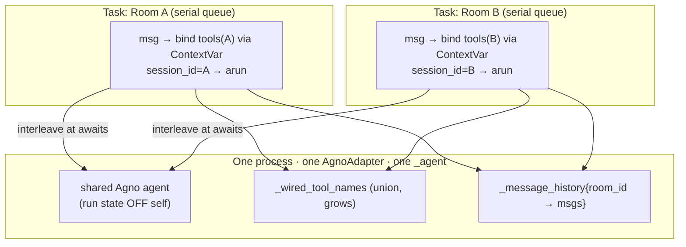
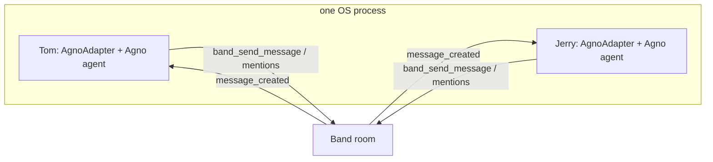

# Agno Adapter — Flow, Concurrency & Risk Analysis

> Design/architecture notes for the `AgnoAdapter` introduced in PR #366
> (`feat: sdk add agno adapter python int 856`). Focus: room switches,
> multi-agent interactions, async safety of the shared instance state, and a
> map of gaps and residual risks.
>
> Source files:
> - `src/band/adapters/agno.py` (`AgnoAdapter`)
> - `src/band/converters/agno.py` (`AgnoHistoryConverter`)
> - Base: `src/band/core/simple_adapter.py` (`SimpleAdapter`)
> - Runtime dispatch: `src/band/runtime/{runtime,execution,presence}.py`,
>   `src/band/preprocessing/default.py`

---

## 1. Mental model in one paragraph

A **single** `AgnoAdapter` instance backs **one** Band agent identity, but that
agent can be in **many rooms at once**. The adapter owns **one** runtime Agno
agent (built once at startup) and serves every room with it. The Band runtime
runs **each room as its own concurrent `asyncio` task** in a **single event
loop**; within a room, messages are processed strictly one-at-a-time. So the
central design question is: *is it safe for one Agno agent object, plus the
adapter's shared dicts/sets/ContextVar, to be driven by multiple concurrent
room tasks?* Short answer: **yes, because per-room run state lives off the
shared agent** (in the returned `RunOutput` and a per-call session keyed by
`session_id`), **per-room transcript state is keyed by `room_id`**, and **the
room→tools binding rides a `ContextVar` that asyncio isolates per task.** The
intentional exceptions (tool-set grows monotonically; tool schemas leak across
rooms) are documented and execution stays room-correct.

---

## 2. The runtime that drives the adapter (why concurrency matters)

Established from the runtime layer (not the adapter):

| Fact | Where | Consequence for the adapter |
|------|-------|------------------------------|
| One `ExecutionContext` **per room**, each with its own `asyncio.Task` running `_process_loop()` | `runtime.py` (`executions: dict[str, Execution]`), `execution.py` (`asyncio.create_task`) | Different rooms call `on_message` **concurrently**, interleaving at every `await`. |
| Per-room `asyncio.Queue`; events dequeued and awaited one at a time | `execution.py` `_process_loop` | Within a room, `on_message` calls are **serialized** and ordered. No same-room overlap. |
| A **fresh** `AgentTools` is built per message via `AgentTools.from_context(ctx)`, bound to `ctx.room_id` | `preprocessing/default.py`, `runtime/tools.py` | The `tools` arg is always room-correct; `send_message`/`send_event`/`execute_tool_call` route to the right room. |
| Everything is one event loop, **no thread/process pool** on the message path | `runtime.py`, `presence.py` | `ContextVar` propagation holds; synchronous blocks (e.g. `add_tool`) are atomic vs. other coroutines. |
| `is_session_bootstrap = not ctx.is_llm_initialized` (true only on a room's first message) | `preprocessing/default.py` | Drives the one-time history seed (see §5). |
| `on_cleanup(room_id)` fires on room removal / agent stop | `runtime.py` `_destroy_execution`, `oneshot.py` | Adapter must drop per-room state there (it does). |

**The two concurrency regimes to keep in mind:**
- **Cross-room (concurrent):** Room A and Room B tasks interleave on the shared agent + shared adapter fields.
- **Within-room (serial):** message N+1 for a room never starts before message N finishes.

---

## 3. Instance & module state — scope and safety

This is the heart of your concern. Every piece of mutable state on the adapter,
classified:

| State | Scope | Written where | Concurrency verdict |
|-------|-------|---------------|---------------------|
| `_agent: AgnoAgent` | **Shared** across all rooms | built once in `on_started` (`deep_copy`/factory) | Shared object driven concurrently — **safe in practice** because `arun` keeps run state off `self` (§4). |
| `_agent_factory` | Shared, read-only after `__init__` | `__init__` | Immutable. Safe. |
| `_session_id_factory` | Shared, read-only | `__init__` | Pure function, defaults to `room_id`. Safe. |
| `_message_history: dict[str, list[Message]]` | **Per-room** (keyed by `room_id`) | `_prior_transcript` (bootstrap seed), `_persist_turn` | Each key is touched only by that room's serial task. **Safe.** Cross-room writes hit different keys. |
| `_wired_tool_names: set[str]` | **Shared, monotonic** | `_ensure_band_tools` | Grows-only union; mutated under synchronous (no-`await`) code. **Safe**, but causes intentional cross-room schema leak (§6). |
| `_band_tools_cache: dict[bool, list[Function]]` | **Shared**, keyed by `include_contacts` | `_ensure_band_tools` | Built at most twice ever. Benign rebuild race at worst (idempotent). **Safe.** |
| `_agno_manages_history: bool` | Shared, set once | `on_started` | Resolved once at startup. Safe. |
| `_current_tools: ContextVar` (module-level) | **Per-asyncio-task** | `_bind_room_tools` (set/reset around `arun`) | **The key safety primitive.** Each room task gets its own context copy; sibling tasks never see each other's value (§4). |
| `agent_name` / converter identity | Shared, set once | `SimpleAdapter.on_started` | Set before any room runs. Safe. |

**Takeaway:** there is exactly **one** piece of state that is both shared and
mutated during a run — the `_agent` object itself. Everything else is either
per-room-keyed, monotonic-and-synchronous, or set-once-at-startup. So the whole
safety argument reduces to "is concurrent `arun` on one agent safe," answered next.

---

## 4. Why concurrent `arun()` on the shared agent is safe (and its one caveat)

Verified against **Agno 2.6.16** (`agno/agent/_run.py`, `agno/agent/agent.py`):

- `arun()` delegates to `_run.arun_dispatch(self, ...)`. Across the entire run
  module there are **no writes of per-run state back onto the agent** —
  no `agent.run_response = …`, no `agent.session_state = …`, no
  `agent.memory = …`. Run state lives in the returned `RunOutput` and a
  per-call **session keyed by `session_id`**, which the adapter sets per room
  via `_session_id_factory(room_id)`.
- The only mutations of `self` during a run are **idempotent**: repeated
  `agent.model = cast(Model, agent.model)` (a no-op cast of the same object) and
  one-time hook normalization guarded by `agent._hooks_normalised = True`.
  Concurrent rooms converge on identical values; there is no torn run-specific
  state.
- `session_id` is passed **per call**, so two rooms with different `room_id`
  get different Agno sessions — DB history, session_state, and summaries do not
  cross-contaminate even when persisted.

**The room→tools binding** is the part that *had* to be solved carefully, and
the `ContextVar` solves it correctly:

```
_run_agent:                          _make_band_entrypoint("...")._entrypoint:
  token = _current_tools.set(tools)     active = _current_tools.get()   # same task
  await agent.arun(... session_id ...)  await active.execute_tool_call(...)
  _current_tools.reset(token)
```

Because each room is a **separate asyncio Task**, and a Task captures/owns its
own copy of the context, `set()` inside Room A's task is invisible to Room B's
task. The Band tool entrypoints are `async` and are awaited **inside** `arun`
**in the same task**, so `get()` returns *that room's* tools. This is what makes
a single module-level `ContextVar` safe for N concurrent rooms.

> **Caveat / risk (low likelihood, high blast radius):** the `ContextVar` is
> only correct as long as band tool entrypoints execute **in the same task** as
> `arun`. Agno keeps a `ThreadPoolExecutor` (`agno-bg`) for `background=True`
> runs and could in principle offload work to a thread. The adapter calls
> `arun(input=…, session_id=…)` with the default `background=False`, and band
> entrypoints are coroutines (awaited inline, never threaded), so today this
> holds. But if a developer's agent forces background execution, or a future
> Agno version runs tools off-loop, `_current_tools.get()` would return `None`
> and entrypoints would degrade to `"Error: no active Band context …"`. Worth a
> guard/test (see §8).

---

## 5. Single-message flow (one room)

```mermaid
sequenceDiagram
    autonumber
    participant RT as Runtime (per-room task)
    participant PP as Preprocessor
    participant SA as SimpleAdapter.on_event
    participant AA as AgnoAdapter.on_message
    participant CV as _current_tools (ContextVar)
    participant AG as Agno agent.arun
    participant Band as Band tools (room-bound)

    RT->>PP: PlatformEvent (room_id)
    PP->>PP: build fresh AgentTools(room_id)
    PP->>SA: on_event(AgentInput)
    SA->>SA: history.convert(AgnoHistoryConverter)
    SA->>AA: on_message(msg, tools, history, …, is_session_bootstrap, room_id)
    AA->>AA: _ensure_band_tools(tools)  ; additive wire onto shared agent
    AA->>AA: _build_run_input  ; copy of committed transcript + injected msgs
    AA->>CV: _bind_room_tools(tools) → set(token)
    AA->>AG: await agent.arun(input, session_id=factory(room_id))
    AG->>Band: (tool call) entrypoint → _current_tools.get() → execute_tool_call
    Band-->>AG: tool result
    AG-->>AA: RunOutput
    AA->>CV: reset(token)
    opt Emit.THOUGHTS
        AA->>Band: send_event(reasoning, "thought")
    end
    opt Emit.EXECUTION
        AA->>Band: send_event(tool_call) + send_event(tool_result) per execution
    end
    AA->>AA: _persist_turn(room_id, response)  ; keep user/assistant/tool roles only
    AA->>Band: _send_reply  ; only if agent did NOT call band_send_message
```

Key per-turn details:

- **Run input is built from a *copy*** of the committed transcript
  (`_prior_transcript` returns `list(...)`). A failed or message-less run leaves
  the committed `_message_history[room_id]` untouched — no injected
  system/participants residue replayed next turn.
- **Persist is allowlisted** to `{user, assistant, tool}` roles, dropping
  Agno's per-run injected system/developer/context/summary messages so they are
  not double-injected next turn.
- **Reply fallback:** if the agent called `band_send_message`, the adapter stays
  quiet; otherwise it posts the final text addressed to the sender, trying
  `sender_id` then `sender_name`, degrading to a warning instead of crashing the
  turn when neither mention resolves.
- **Error path:** any exception in `arun` posts a generic `error` event (no
  tracebacks/DB strings to chat) and re-raises.

---

## 6. Room switches & multi-room concurrency



What "switching rooms" actually means here — there is no explicit switch; rooms
are independent concurrent tasks sharing one agent. The isolation comes from:

1. **`session_id` per room** → Agno session/DB/summary state never crosses rooms.
2. **`_message_history` keyed by `room_id`** → Band's own transcript is per-room.
3. **`ContextVar` per task** → the right room's tools during each `arun`.

**The one deliberate cross-room coupling — tool schema visibility.**
`_ensure_band_tools` wires tools **additively and idempotently** onto the shared
agent and never removes them. So once any room (e.g. a contact-hub room) causes
contact tools to be wired, *their schemas remain visible to the model in all
rooms*. This is **documented as intentional** in the adapter docstring.
Execution stays room-correct because every entrypoint routes through
`_current_tools` → the current room's `AgentTools`. The practical effect is a
**prompt-surface** concern (a room's model can *see* a tool it arguably
shouldn't), not a correctness or data-leak bug — calling it still acts on the
calling room. Flagged in §8 as a low-severity gap for strict per-room visibility.

---

## 7. Multi-agent interactions

Two distinct senses — don't conflate them:

**(a) Many independent Band agents (the Tom & Jerry example).**
`examples/agno/03_tom_and_jerry.py` builds **two separate `AgnoAdapter`
instances**, each wrapping its own Agno agent, each its own Band identity, run
together with `asyncio.gather`. They interact **only through the room** (mentions,
`band_send_message`, peer lookup/invite). There is **no shared adapter state**
between them — so the §3/§4 analysis applies independently per agent. This is the
clean, safe multi-agent story: coordination happens on the platform, not in
shared Python objects.



Watch-outs specific to multi-agent rooms:
- **Reply-loops:** the text fallback in `_send_reply` auto-addresses the sender.
  Two auto-replying agents that mention each other can ping-pong. Steer agents to
  call `band_send_message` explicitly (the base prompt already says plain text
  "is not delivered"), or rely on platform-side loop dampening. Worth calling out
  to developers.
- **Own-message filtering** is the converter's job (next point).

**(b) One agent across many rooms** — covered in §6.

**Converter & identity in multi-agent rooms.** `AgnoHistoryConverter` maps a
past message to the `assistant` role only when `role == "assistant"` **and**
`sender_name == self._agent_name`; everything else becomes a `user` turn
prefixed `"[sender]: …"`. The docstring correctly flags the risk: own-agent
detection keys on **`sender_name`, not a stable id**, because formatted history
carries only `sender_name`. **Two participants sharing a display name, or an
agent rename, can mis-map prior assistant turns to the user role** (and vice
versa). In multi-agent rooms with similar names this is the most likely
correctness foot-gun. Flagged in §8.

---

## 8. Gaps & risk register

| # | Area | Risk | Severity | Status / mitigation |
|---|------|------|----------|---------------------|
| R1 | Converter identity | Own-agent detection keys on `sender_name`; duplicate display names or agent rename mis-maps assistant↔user roles | **Medium** | Documented in converter. Consider keying on a stable sender id if/when formatted history carries one; add a test with duplicate names. |
| R2 | ContextVar binding | If band tool entrypoints ever run off the `arun` task (Agno `background=True`/thread offload), `_current_tools.get()` → `None` → `"Error: no active Band context"` | **Low likelihood / High impact** | Holds today (`background=False`, async entrypoints). Add a regression test asserting tools resolve under `arun`; document that `background=True` is unsupported. |
| R3 | Tool schema visibility | Additive union → tools wired for one room (e.g. contacts) stay visible to the model in all rooms | **Low** | Intentional + documented; execution stays room-correct. Only matters if strict per-room visibility is a requirement. |
| R4 | Multi-agent reply loops | Text fallback auto-replies to sender; two auto-replying agents can ping-pong | **Medium (product)** | Mitigated by steering to `band_send_message`. Consider a per-room turn cap / loop-break, or document the pattern prominently. |
| R5 | History double-source | Agno self-managed history (`add_history_to_context` + `db`) colliding with Band rehydration | **Handled** | `_detect_agno_history` disables Band rehydration and warns. Good. |
| R6 | Memory collision | Band memory tools + Agno `update_memory_on_run`/`enable_agentic_memory` both active | **Handled (warn-only)** | `_warn_on_memory_collision` warns but does not disable either — both still run. Consider hard-failing or auto-disabling one if collisions cause real corruption. |
| R7 | `session_id_factory` override | Overrides any `session_id` on the agent → previously stored single-session DB history is no longer reused (keyed by `room_id`) | **Low / by-design** | Documented in `__init__`. Surfaces only for users migrating an agent that relied on a fixed `session_id`. |
| R8 | Transcript growth | `_message_history[room_id]` holds the full per-room transcript in memory for the process lifetime | **Low** | Cleared on `on_cleanup`. For very long-lived rooms with no Agno `db`, memory grows unbounded; consider a cap/trim. |
| R9 | `deep_copy` cost/fidelity | When `agent=` is passed, startup runs `agent.deep_copy()`; deep-copy must faithfully clone model/tools/hooks | **Low** | `agent_factory=` path avoids deep-copy entirely; recommend it for heavyweight agents. |
| R10 | `_band_tools_cache` rebuild race | Two rooms first-seen concurrently could both build the same `include_contacts` entry | **Negligible** | Build is pure/idempotent; worst case is a redundant build, last write wins. |

---

## 9. Completeness checklist (does it cover the lifecycle?)

| Lifecycle stage | Covered? | Notes |
|-----------------|----------|-------|
| Construction validation (`agent` xor `agent_factory`) | ✅ | Raises on both/neither; agent-dependent checks deferred to `on_started`. |
| Startup (`on_started`) | ✅ | Builds runtime agent, detects self-managed history, warns on memory collision, injects guidance, syncs converter identity. |
| First message per room (bootstrap) | ✅ | Seeds `_message_history[room_id]` from rehydrated platform history (unless Agno manages history). |
| Steady-state message | ✅ | Copy-based input build, run, emit, persist, reply. |
| Tool wiring | ✅ | Additive, idempotent, cached, capability-/hub-gated. |
| Emit.THOUGHTS / Emit.EXECUTION | ✅ | Opt-in; self-reporting tools excluded from execution emit. |
| Reply delivery | ✅ | `band_send_message` short-circuit + addressed text fallback + graceful mention failure. |
| Error handling | ✅ | Generic error event, no sensitive text, re-raise for runtime. |
| Room leave (`on_cleanup`) | ✅ | Drops `_message_history[room_id]`. |
| Cross-room concurrency | ✅ | Safe via per-room session_id, per-room transcript keys, per-task ContextVar. |
| Process shutdown | ⚠️ | No explicit teardown of the shared agent (e.g. Agno background executor / MCP tools / DB handles). Usually fine for process exit, but consider an `aclose` if Agno holds resources. |

---

## 10. Bottom line

The implementation is **safe and substantially complete** for the concurrency
model it runs under. The async design is correct for the right reasons: per-room
asyncio-task isolation makes the module-level `ContextVar` safe, per-room
`session_id` keeps Agno session state from crossing rooms, and per-`room_id`
transcript keys keep Band's own history isolated — while the genuinely shared
agent object is safe to drive concurrently because Agno 2.6 keeps run state off
`self`. The remaining items are **edge-correctness and product-shape** concerns,
not structural flaws: converter identity-by-name (R1), the off-task ContextVar
edge (R2), intentional tool-schema leak (R3), and multi-agent reply loops (R4)
are the ones worth a test or a doc note before calling it done.
